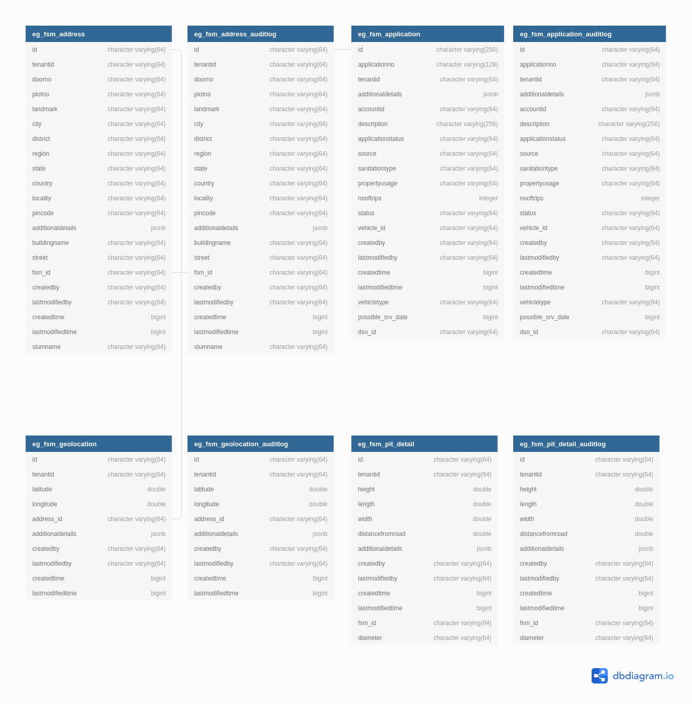

# fsm

Faecal sludge management (FSM) is a system that enables citizen to raise a request for septic tank cleaning with there ULB’s directly or reaching out to ULB counter. Citizen can track the application, make a payment for the charges and rate the service. This document contains the details about how to setup the fsm and describes the functionalities it provides.   

### DB UML Diagram

### Service Dependencies

- billing-service
- mdms-service
- workflow-v2
- boundary-service
- user-service
- idgen-service
- user-events
- collection-service
- notification-service
- vendor
- vehicle
- fsm-calculator
- egov-url-shortener
- collection-service
- pdf-service

### Swagger API Contract

Link to the swagger API contract [yaml](https://raw.githubusercontent.com/egovernments/municipal-services/master/docs/fsm/Fsm_Apply_Contract.yaml) and editor link like below

### Postman Collection
Link to the postman collection [here](https://www.getpostman.com/collections/8b9eb951a810486f41a4)

## Service Details

**Faecal sludge management**

fsm service helps to create/raise a Request for Septic Tank cleaning for ULB by citizen directly thrugh online portal or by approaching the ULB.

*FSM Flow*

- Citizen creates/raises a application for septic tank cleaning

- ULB Employee reviews the request, updates the vehicleType based on the Application

- System would generate a Demand for the Application 

- Citizen would pay the Demand

- ULB Employee identifies the DSO who can pickup the request and assign's DSO to the application

- DSO can Accept or Reject the application, If rejected by DSO. ULB Employee would assign another DSO. While DSO Accepting the Application would assign a vehicle to the application. System would internally Schedule VehicleTrip

- DSO would visit the site and after cleaning septic tank, would mark the application as complete, System would mark the respective VehicleTrip ready for disposal

- Citizen can provide feedback in Rating as well as answer the Questions configure.

### API Details

`_create` : This API is used to create an application for the Desludging in the system. Whenever an application is created a application number is generated and assigned to the application for future reference.

`_search` : This API is used to search the applications in the system based on various search parameters like mobile number, application number,status etc.

`_update` : The _update API is used to update the application information or to forward the application from one state to another.

`_audit`  : This API is used to search the Audit log of a particular applicaation in the system bsed on the appliationNo or id of the FSM and tenantId.

### Reference Document
TBD

### Kafka Consumers

- **egov.collection.payment-create** : service receives the data from this topic to update the status of the application on payment receipt creation

- **save-fsm-application** : service receives data from this topic to send notification to the user 

- **update-fsm-application** : service receives data from this topic to send notification to the user on application status change

- **update-fsm-workflow-application** : service receives data from this topic to send notification to the user on application status change

### Kafka Producers
- **save-fsm-application** : service sends data to this topic to create new FSM Application

- **update-fsm-application** : service sends data to this topic to update the FSM application with updatable state of workflow

- **update-fsm-workflow-application** : service sends data to this topic to update the FSM application with not updatablestate of workflow

- **egov.core.notification.sms** : service sends sms data to this topic to send sms notifications to the owner for every workflow state change
