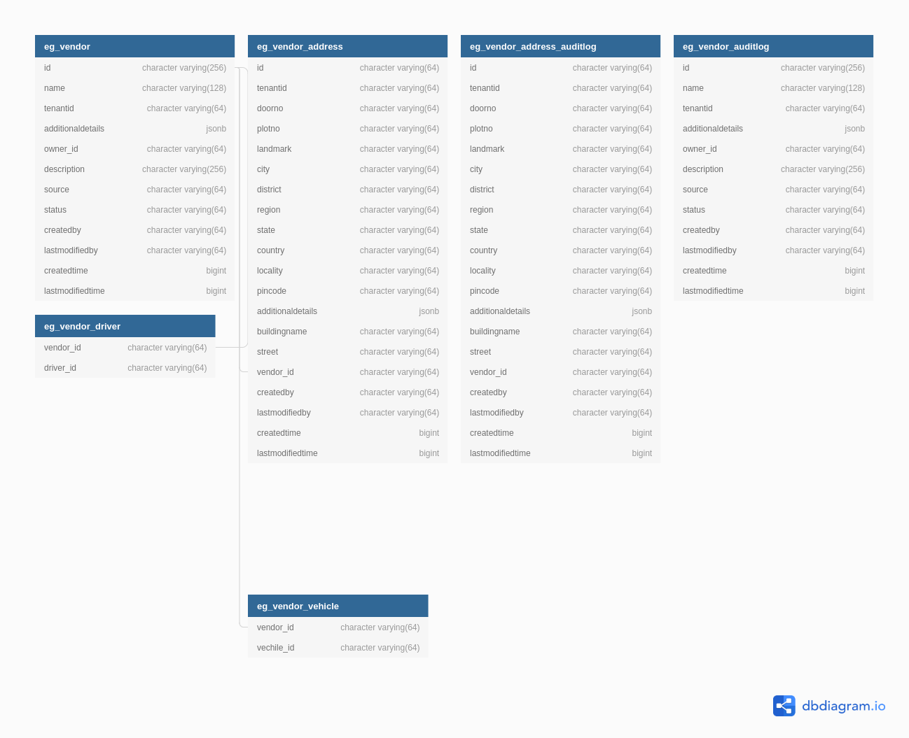

# Vendor

Vehicle Registry is a system that enables ULB Employees to create and search Vendor i.e Desluding Operator (DSO) and driver entities with appropriate vehicle Entities  for FSM Application. This document contains the details about how to setup the Vendor and describe the functionalities provided.

### DB UML Diagram

### Service Dependencies

- egov-mdms-service
- egov-user-service
- boundary-service
- vehicle

### Swagger API Contract

Link to the swagger API contract [yaml](https://raw.githubusercontent.com/egovernments/municipal-services/master/docs/fsm/Vendor_Registration_Contract.yaml) and editor link like below

### Postman Collection
Link to the postman collection [here](https://www.getpostman.com/collections/2d55f98479499672a23e)

## Service Details

**Vendor Registry**

- Contains the API's to create,  search Vendor i.e DSO in FSM Case

### API Details

`v1/_create` 		: The create api to create Vendor in the system

`v1/_search`		: The search api to fetch the Vendors in the system based on the search criteria

### Reference Document
TBD

### Kafka Consumers
NA

### Kafka Producers

- **save-vendor-application** 			: service sends data to this topic to create new Vendor.